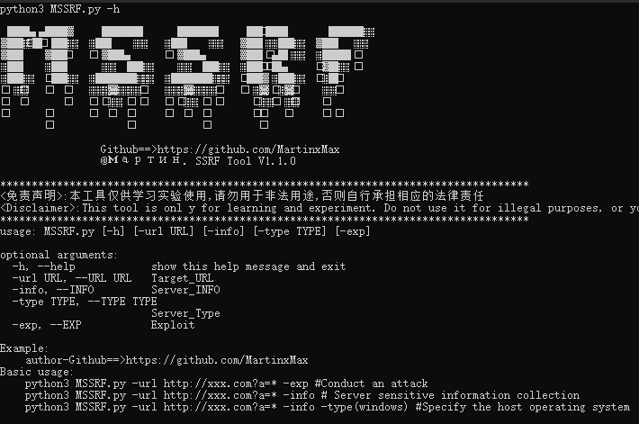
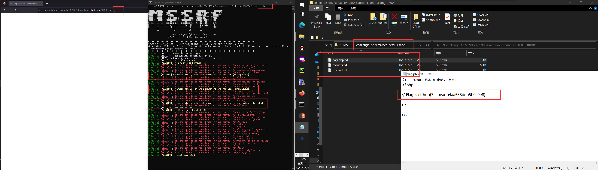

  <div align="center">
 <p align="center">
 
 
 
  
 
 
 </p>
  
  
   
 <table>
  <tr>
      <th>Function</th>
  </tr>
  <tr>
    <th>
        Server sensitive file collection
    </th>
    
  </tr>
 <tr>
    <th>
        SSRF attack
    </th>
 </tr>
 </table>
</div>

## usage method
  * View help information

      ```#python3 MSSRF.py -h```

    

# Sensitive information collection

```#python3 MSSRF.py -url http://Martin.com?url=* -info```

    


# SSRF Springboard attack

```#python3 MSSRF.py -url http://Martin.com?url=* -info -exp```


  


