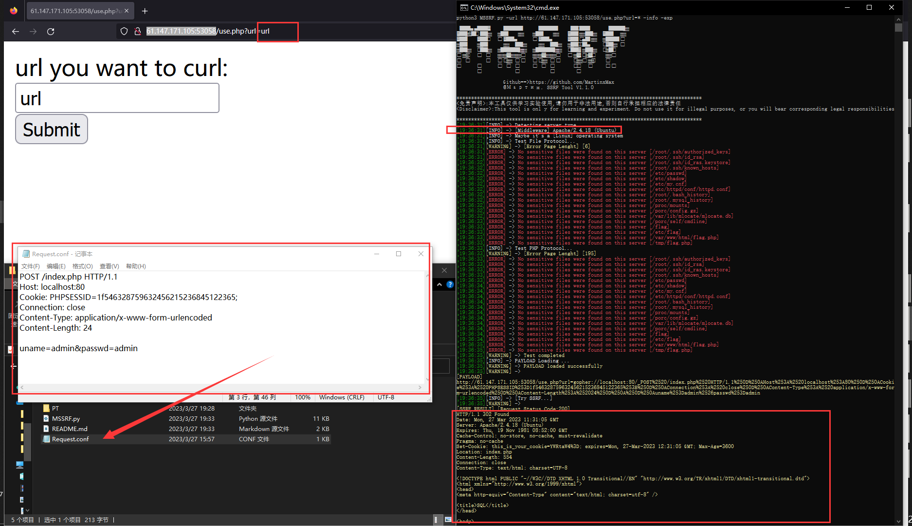

  <div align="center">
 <p align="center">
 
 
 
  
 
 
 </p>
  
  
   
 <table>
  <tr>
      <th>Function</th>
  </tr>
  <tr>
    <th>
        SSRF attack
    </th>
  </tr>
 </table>
</div>

## usage method
  * View help information

      ```#python3 MSSRF.py -h```

    

# Send request


Find injection point

    

__PS:You must mark the injection point with * and write the request message required to access other websites into the Request.conf file__

 ```#python3 MSSRF.py -url http://61.147.171.105:50765/use.php?url=*```

    
  
_The server successfully requested another page_
 
    
  